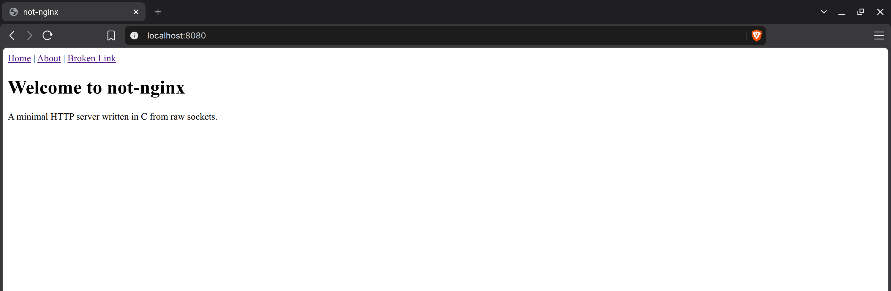
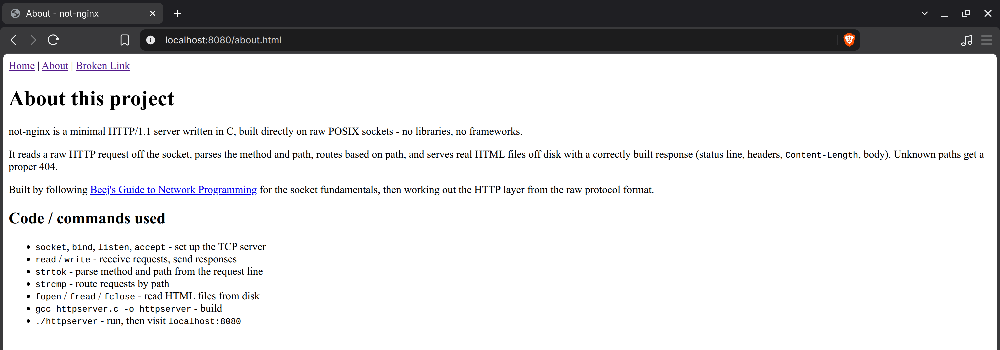
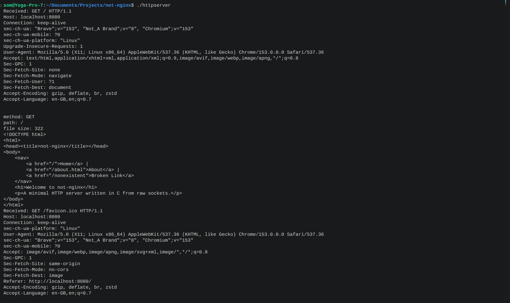

# not-nginx

A minimal HTTP/1.1 server written in C from raw sockets — no libraries, no frameworks.


## What it does
- Accepts TCP connections and reads raw HTTP requests
- Parses the request line to extract method and path
- Routes by path, serving real HTML files from disk with a correctly built
  response (status line, headers, `Content-Length`, body)
- Returns a proper 404 for unknown paths and for missing/unreadable files,
  instead of crashing

  

## What it doesn't do (yet)
- Handle POST or other methods
- Handle multiple simultaneous clients (no fork/threads/select yet)
- Route dynamically — new pages currently need a hardcoded branch

## Build & run
```bash
gcc httpserver.c -o httpserver
./httpserver
```
Then visit `http://localhost:8080` in a browser.

## Why
Following [Beej's Guide to Network Programming](https://beej.us/guide/bgnet/) to understand sockets and HTTP from the ground up rather than starting with a framework.